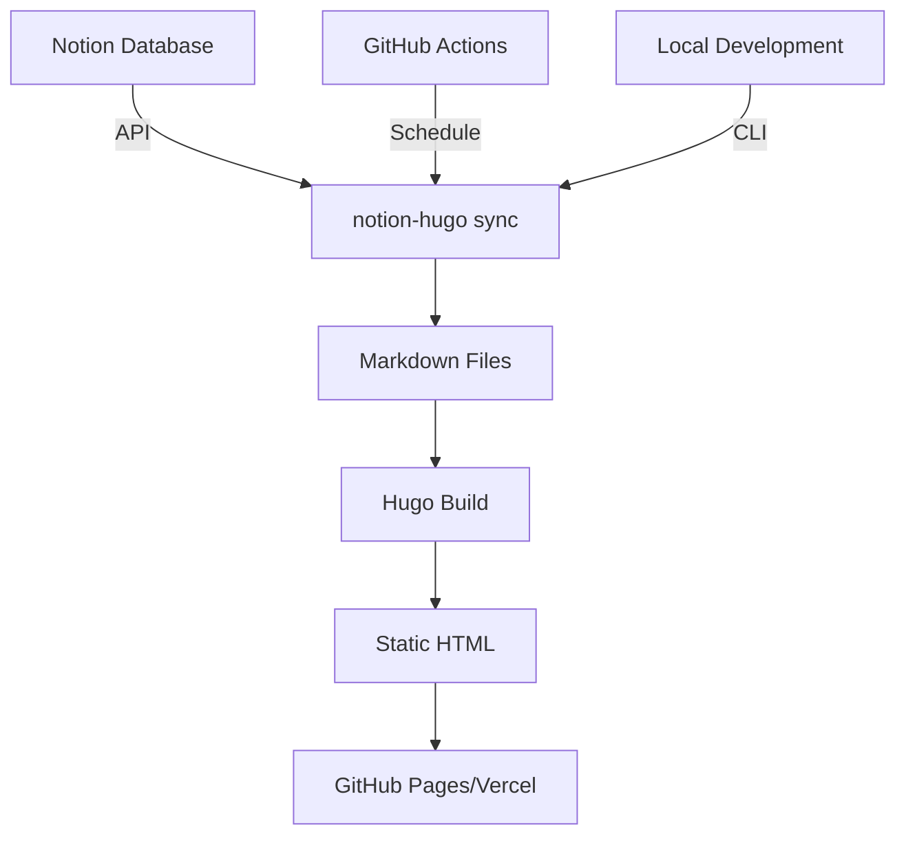

# notion-hugo

> Turn your Notion into a Hugo blog in minutes. Write in Notion, deploy with Hugo, no hassle.

[](https://pypi.org/project/notion-hugo/)
[](https://pypi.org/project/notion-hugo/)
[](https://github.com/adalgu/notion-hugo/actions)
[](LICENSE)
[](https://github.com/adalgu/notion-hugo)

## What is notion-hugo?

A production-ready tool that syncs your Notion content to a Hugo static site. Built by an engineer who got tired of choosing between Notion's writing experience and Hugo's performance.

**→ Try it now: 5 minutes from install to live blog**

## ✨ Features

- **🚀 True One-Click Deploy** - Single command from Notion to live site
- **⚡ Smart Incremental Sync** - Only updates changed content
- **🎯 Zero Config Required** - Intelligent defaults, just add your Notion token
- **📦 Complete Package** - Includes theme, CI/CD, GitHub Pages setup
- **🔄 Auto-sync Every Hour** - Set it and forget it
- **🎨 Beautiful by Default** - PaperMod theme pre-configured

## 🚀 Quick Start

### The Famous 5-Minute Setup

```bash
# 1. Install
pip install notion-hugo

# 2. Initialize 
notion-hugo init --token YOUR_NOTION_TOKEN

# 3. Deploy
notion-hugo deploy

# Done! Your blog is live 🎉
```

### What Just Happened?

1. ✅ Created a Notion database with the right schema
2. ✅ Generated sample posts to get you started  
3. ✅ Configured Hugo with an optimized theme
4. ✅ Set up GitHub Actions for auto-deployment
5. ✅ Deployed to GitHub Pages (or Vercel)

## 📖 Installation

### Prerequisites

- Python 3.8+
- A Notion account with API access ([Get your token](https://www.notion.so/my-integrations))
- A GitHub account (for deployment)

### Install via pip

```bash
pip install notion-hugo
```

### Install from source

```bash
git clone https://github.com/adalgu/notion-hugo.git
cd notion-hugo
pip install -e .
```

## 🔧 Configuration

### Minimal Config (99% of users)

```yaml
# notion-hugo.yaml
notion:
  token: ${NOTION_TOKEN}  # Set via environment variable
  database_id: auto       # Auto-creates one for you
```

### Advanced Config

```yaml
# notion-hugo.yaml
notion:
  token: ${NOTION_TOKEN}
  database_id: your-database-id
  
hugo:
  base_url: https://yourdomain.com
  theme: PaperMod  # or any Hugo theme
  
sync:
  mode: incremental  # or 'full'
  schedule: "0 * * * *"  # Hourly
  
deploy:
  target: github  # or 'vercel', 'netlify'
```

## 📝 Usage

### CLI Commands

```bash
# Initialize new blog
notion-hugo init

# Sync content from Notion
notion-hugo sync

# Build Hugo site
notion-hugo build

# Deploy to production
notion-hugo deploy

# Run local preview
notion-hugo serve
```

### Notion Properties Mapping

Your Notion database automatically gets these properties:

| Notion Property | Hugo Frontmatter | Type | Required |
|---|---|---|---|
| Title | title | Text | ✅ |
| Date | date | Date | ✅ |
| Published | draft | Checkbox | ✅ |
| Summary | description | Text | |
| Tags | tags | Multi-select | |
| Category | categories | Select | |

### GitHub Actions (Auto-sync)

The tool automatically creates `.github/workflows/notion-hugo.yml`:

```yaml
name: Notion → Hugo → Deploy
on:
  schedule:
    - cron: '0 * * * *'  # Every hour
  push:
    branches: [main]
    
jobs:
  sync-and-deploy:
    runs-on: ubuntu-latest
    steps:
      - uses: actions/checkout@v3
      - uses: actions/setup-python@v4
      - run: pip install notion-hugo
      - run: notion-hugo sync
      - run: notion-hugo build
      - run: notion-hugo deploy
```

## 🏗️ Architecture



### How It Works

1. **Sync Engine** - Fetches content via Notion API
2. **Markdown Converter** - Transforms blocks to Hugo-compatible markdown
3. **Smart Differ** - Tracks changes to minimize API calls
4. **Hugo Builder** - Generates optimized static site
5. **Deploy Manager** - Pushes to your chosen platform

## 🚢 Deployment Options

### GitHub Pages (Default)

```bash
notion-hugo deploy --target github
```

- Free hosting at `username.github.io/repo`
- Custom domain support
- Automatic HTTPS

### Vercel

```bash
notion-hugo deploy --target vercel
```

- Instant global CDN
- Preview deployments
- Advanced analytics

### Self-Hosted

```bash
notion-hugo build
# Upload ./public to any web server
```

## 🐛 Troubleshooting

### Common Issues

| Problem | Solution |
|---------|----------|
| "Notion API Error" | Check token permissions in Notion settings |
| "Hugo build failed" | Run `notion-hugo validate` to check setup |
| "Deploy failed" | Ensure GitHub Actions is enabled in repo |
| "Sync missed changes" | Run `notion-hugo sync --full` for complete sync |

### Debug Mode

```bash
# Verbose output
notion-hugo --debug sync

# Check current state
notion-hugo status

# Validate configuration
notion-hugo validate
```

## 🤝 Contributing

Contributions are welcome! See [CONTRIBUTING.md](CONTRIBUTING.md) for guidelines.

```bash
# Development setup
git clone https://github.com/adalgu/notion-hugo.git
cd notion-hugo
pip install -e ".[dev]"
pytest
```

## 📊 Performance

Real-world metrics from production use:

- **Sync Speed**: ~1s per 10 posts
- **Build Time**: <3s for 100 posts  
- **Deploy Time**: <1 min total
- **API Efficiency**: 1 call per changed page
- **Lighthouse Score**: 100/100

## 🔒 Security

- Notion token stored in environment variables
- No credentials in repository
- Static output (no server vulnerabilities)
- Dependabot enabled for updates

## 📚 Documentation

- [Full Documentation](https://adalgu.github.io/notion-hugo)
- [API Reference](https://adalgu.github.io/notion-hugo/api)
- [Examples](https://github.com/adalgu/notion-hugo/tree/main/examples)
- [Changelog](CHANGELOG.md)

## 🗺️ Roadmap

- [x] Basic Notion → Hugo sync
- [x] GitHub Actions integration
- [x] Incremental sync
- [x] Multiple deployment targets
- [ ] Bi-directional sync
- [ ] Multiple database support
- [ ] Custom shortcodes
- [ ] Plugin system

## 📄 License

GPL-3.0 - see [LICENSE](LICENSE) for details.

## 🙏 Acknowledgments

Standing on the shoulders of giants:

- [Hugo](https://gohugo.io) - The world's fastest framework
- [Notion API](https://developers.notion.com) - Making content programmable
- [notion-py](https://github.com/jamalex/notion-py) - Inspiration for API handling

## 👨‍💻 Author

**Gunn Kim** - Applied Scientist & Engineer

- GitHub: [@adalgu](https://github.com/adalgu)
- Blog: [gunn.kim](https://gunn.kim) (powered by notion-hugo!)
- LinkedIn: [Connect with me](https://linkedin.com/in/gunnkim)

---

<div align="center">

**⭐ Star this repo if it helps you!**

*From Notion to Hugo blog in 5 minutes. Really.*

[Get Started](https://github.com/adalgu/notion-hugo) • [Documentation](https://adalgu.github.io/notion-hugo) • [Report Bug](https://github.com/adalgu/notion-hugo/issues)

</div>
