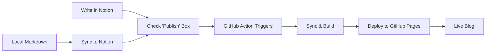

# Notion-Hugo Flow

> Transform your Notion workspace into a blazing-fast Hugo blog with smart automation and bidirectional sync.

[](https://github.com/features/actions)
[](https://gohugo.io)
[](https://developers.notion.com)
[](https://www.python.org)
[](LICENSE)

## Why Notion-Hugo Flow?

**Write in Notion. Sync with Local. Publish with Hugo. Deploy anywhere.**

After 15+ years building content systems at scale, I've learned that the best tools get out of your way. Notion-Hugo Flow bridges the gap between Notion's intuitive editing experience, local markdown workflows, and Hugo's unmatched static site performance.

### Key Features

- 🚀 **Smart Sync** - Incremental updates, only syncs what changed
- 🔄 **Bidirectional Sync** - Notion ↔ Local markdown synchronization
- 🎯 **Zero Config** - Auto-detects environment, configures accordingly  
- 📦 **GitHub Pages First** - Optimized for GitHub's free hosting
- 🔄 **CI/CD Ready** - GitHub Actions workflow included
- 🎨 **Theme Included** - PaperMod pre-configured and optimized
- 🔍 **SEO Optimized** - Structured data, meta tags, sitemaps
- 🤖 **LLM Ready** - Optimized workflow for AI-assisted content creation

## Quick Start

```bash
# One command setup
git clone https://github.com/adalgu/notion-hugo-flow.git
cd notion-hugo-flow
python app.py quickstart --token YOUR_NOTION_TOKEN
```

That's it. Your blog is ready. Push to GitHub and it's live in 5 minutes.

## How It Works



## Installation

### Prerequisites

- Python 3.8+
- Git
- Notion API key ([Get one here](https://www.notion.so/my-integrations))

### Method 1: Automated Setup (Recommended)

```bash
curl -sSL https://raw.githubusercontent.com/adalgu/notion-hugo-flow/main/scripts/quickstart-github.sh | bash
```

### Method 2: Manual Setup

```bash
# 1. Clone
git clone https://github.com/adalgu/notion-hugo-flow.git
cd notion-hugo-flow

# 2. Install dependencies
pip install -r dev/requirements.txt

# 3. Run quickstart
python app.py quickstart --token YOUR_NOTION_TOKEN

# 4. Add GitHub Secret
# Go to: Settings → Secrets → Actions
# Add: NOTION_TOKEN = your_token

# 5. Push
git push origin main
```

## Configuration

### Smart Defaults

Notion-Hugo Flow automatically detects and configures:

- **Base URL** - GitHub Pages URL structure
- **Theme** - PaperMod with optimal settings
- **Deployment** - GitHub Actions workflow
- **Caching** - Smart incremental sync

### Environment Variables

```bash
# Required
NOTION_TOKEN=your_notion_integration_token

# Optional
NOTION_DATABASE_ID_POSTS=your_database_id
HUGO_BASE_URL=https://yourusername.github.io
```

## Workflow Modes

### 1. Notion-First Workflow
- Write content in Notion
- Use the intuitive rich text editor
- Automatic sync to Hugo blog

### 2. Local-First Workflow (Recommended for LLM)
- Create markdown files locally
- Use LLM tools for content generation
- Sync to Notion for collaboration
- Deploy to Hugo blog

### 3. Bidirectional Sync
- Edit in either Notion or local files
- Automatic conflict resolution
- Maintain content integrity across platforms

## Advanced Features

### LLM Integration
- Optimized for AI-assisted content creation
- Local markdown workflow reduces API costs
- Smart sync minimizes token usage

### Content Management
- Draft/publish workflow
- Category and tag management
- Image optimization
- SEO metadata handling

### Deployment Options
- GitHub Pages (default)
- Vercel
- Netlify
- Custom hosting

## Contributing

We welcome contributions! Please see our [Contributing Guide](CONTRIBUTING.md) for details.

### Development Setup

```bash
git clone https://github.com/adalgu/notion-hugo-flow.git
cd notion-hugo-flow
pip install -e .
python -m pytest
```

## License

This project is licensed under the MIT License - see the [LICENSE](LICENSE) file for details.

## Support

- 📖 [Documentation](https://github.com/adalgu/notion-hugo-flow/wiki)
- 🐛 [Issues](https://github.com/adalgu/notion-hugo-flow/issues)
- 💬 [Discussions](https://github.com/adalgu/notion-hugo-flow/discussions)

## Acknowledgments

- [Hugo](https://gohugo.io/) - The world's fastest framework for building websites
- [Notion API](https://developers.notion.com/) - Powerful content management
- [PaperMod Theme](https://github.com/adityatelange/hugo-PaperMod) - Beautiful Hugo theme
- [GitHub Actions](https://github.com/features/actions) - CI/CD automation

---

**Made with ❤️ for the open source community**
