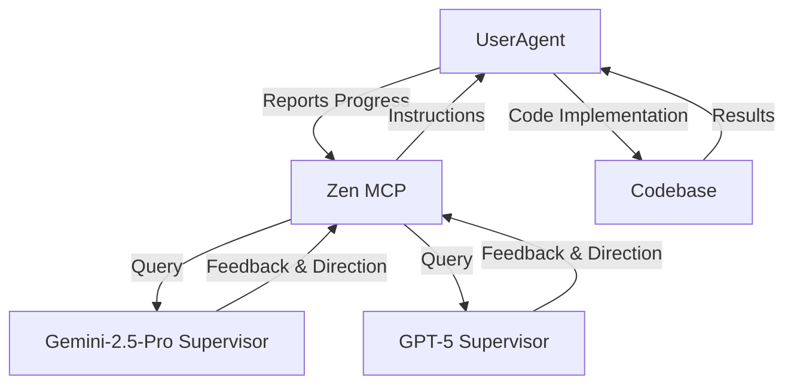

# AI-Supervised Implementation Strategy

## 🎯 Objective Function with AI Supervision

**목표**: Zen MCP를 통한 AI Supervisors와의 자동화된 개발 사이클로 완벽한 파이프라인 구현

## 🤖 AI Supervision Architecture



## 🔄 Automated Development Cycle

### 1. Report → Review → Implement → Report

```yaml
cycle:
  1. report_progress:
      - current_status: "Starting Hugo-Pipeline implementation"
      - completed_tasks: ["File structure analysis", "Requirements gathering"]
      - next_steps: ["Implement hugo/pipeline.py", "Fix theme path issues"]
      - blockers: ["Theme path resolution unclear"]
      
  2. get_ai_feedback:
      - supervisors: [gemini-2.5-pro, gpt-5]
      - questions: 
        - "Should we prioritize theme path fix or rebuild structure?"
        - "What's the best approach for Hugo working directory management?"
      
  3. implement_code:
      - based_on: ai_supervisor_feedback
      - validate: real_time_testing
      - commit: incremental_progress
      
  4. report_results:
      - implementation_status: success/failure
      - test_results: pass/fail
      - next_cycle_input: lessons_learned
```

## 🧠 Enhanced UserAgent with Zen MCP Integration

### UserAgent Specification Update

```python
# Enhanced UserAgent with AI Supervision
class EnhancedUserAgent:
    def __init__(self):
        self.tools = [
            "Read", "Write", "Edit", "MultiEdit",  # Core tools
            "Bash", "Glob", "Grep",               # System tools
            "zen_mcp_query",                      # NEW: AI Supervisor communication
            "zen_mcp_report",                     # NEW: Progress reporting
            "TodoWrite"                           # Progress tracking
        ]
        self.supervisors = {
            "gemini": "gemini-2.5-pro",
            "gpt": "gpt-5"
        }
        
    async def supervised_implementation_cycle(self, task):
        """Automated development cycle with AI supervision"""
        
        # 1. Report current status
        progress_report = self.generate_progress_report(task)
        await self.zen_mcp_report(progress_report)
        
        # 2. Get AI supervisor feedback
        feedback = await self.get_supervisor_feedback(task)
        
        # 3. Implement based on feedback
        implementation_result = await self.implement_with_feedback(feedback)
        
        # 4. Test and validate
        test_results = await self.validate_implementation(implementation_result)
        
        # 5. Report results and get next steps
        await self.report_results_and_continue(test_results)
```

## 📋 Implementation Strategy by Phase

### Phase 1: Setup AI Supervision Infrastructure

**UserAgent Tasks**:

1. **Zen MCP Integration Setup**
   ```python
   # Add zen_mcp tools to UserAgent
   tools = [
       # ... existing tools ...
       "zen_mcp_query",     # Query AI supervisors
       "zen_mcp_report",    # Report progress
       "zen_mcp_feedback"   # Get structured feedback
   ]
   ```

2. **AI Supervisor Prompt Templates**
   ```yaml
   supervisor_prompts:
     progress_review:
       template: |
         Current implementation status: {status}
         Completed: {completed_tasks}
         Next steps: {next_steps}
         Blockers: {blockers}
         
         Please provide:
         1. Priority assessment (1-10)
         2. Risk analysis
         3. Alternative approaches
         4. Specific implementation guidance
   ```

### Phase 2: Implement Supervised Subagents

#### 2.1 Hugo-Pipeline Agent with AI Supervision

**Objective Function**: Fix Hugo build issues with AI guidance

**Supervision Workflow**:

```python
# Supervised Hugo-Pipeline Implementation
class SupervisedHugoPipelineAgent(UserAgent):
    
    async def implement_hugo_pipeline(self):
        # 1. Report current Hugo issues
        report = {
            "current_issues": [
                "Theme path resolution",
                "Config file conflicts", 
                "Working directory problems"
            ],
            "attempted_solutions": [
                "Moved themes directory",
                "Updated config paths"
            ],
            "current_blockers": [
                "Hugo still can't find theme",
                "Build fails with layout errors"
            ]
        }
        
        await self.zen_mcp_report("hugo_pipeline_status", report)
        
        # 2. Get AI supervisor guidance
        feedback = await self.zen_mcp_query(
            supervisors=["gemini-2.5-pro", "gpt-5"],
            question="""
            Given the Hugo theme path issues, what's the best approach:
            A) Fix current blog/ subdirectory structure
            B) Move everything to root
            C) Rebuild with proper working directory handling
            
            Please provide specific implementation steps.
            """
        )
        
        # 3. Implement based on AI feedback
        implementation_plan = feedback.get_consensus_plan()
        for step in implementation_plan.steps:
            result = await self.execute_implementation_step(step)
            await self.validate_step(step, result)
            
        # 4. Report final results
        await self.report_implementation_complete()
```

#### 2.2 Notion-Pipeline Agent with AI Supervision

**Supervision Focus**:

- API optimization strategies
- Error handling approaches  
- Data integrity validation
- Performance optimization

#### 2.3 Deployment-Pipeline Agent with AI Supervision

**Supervision Focus**:

- Platform-specific deployment strategies
- Error recovery mechanisms
- Security considerations
- Performance monitoring

## 🔍 AI Supervisor Query Templates

### 1. Architecture Review Queries

```python
architecture_queries = {
    "structure_validation": {
        "prompt": """
        Review this proposed file structure:
        {proposed_structure}
        
        Assess:
        1. Maintainability (1-10)
        2. Scalability (1-10)  
        3. Industry best practices alignment
        4. Potential issues
        5. Improvement suggestions
        """,
        "supervisors": ["gemini-2.5-pro", "gpt-5"]
    },
    
    "implementation_approach": {
        "prompt": """
        Given this objective: {objective}
        Current status: {current_status}
        Constraints: {constraints}
        
        Recommend:
        1. Implementation priority order
        2. Risk mitigation strategies
        3. Testing approach
        4. Success criteria validation
        """,
        "supervisors": ["gemini-2.5-pro"]
    }
}
```

### 2. Code Review Queries

```python
code_review_queries = {
    "implementation_review": {
        "prompt": """
        Review this implementation:
        {code_snippet}
        
        Evaluate:
        1. Code quality (1-10)
        2. Error handling adequacy
        3. Performance considerations
        4. Security implications
        5. Refactoring suggestions
        """,
        "supervisors": ["gpt-5", "gemini-2.5-pro"]
    }
}
```

### 3. Problem Resolution Queries

```python
problem_resolution_queries = {
    "blocker_resolution": {
        "prompt": """
        Current blocker: {blocker_description}
        Attempted solutions: {attempted_solutions}
        Error logs: {error_logs}
        
        Provide:
        1. Root cause analysis
        2. 3 alternative solution approaches
        3. Recommended solution with rationale
        4. Implementation steps
        5. Validation criteria
        """,
        "supervisors": ["gemini-2.5-pro", "gpt-5"]
    }
}
```

## 📊 Supervision Metrics & Feedback Loop

### Success Metrics with AI Oversight

```python
supervision_metrics = {
    "code_quality": {
        "ai_review_score": 0.0,  # AI supervisor rating
        "human_validation": False,
        "test_coverage": 0.0,
        "performance_score": 0.0
    },
    
    "implementation_efficiency": {
        "cycles_to_completion": 0,
        "ai_guidance_accuracy": 0.0,
        "human_intervention_required": False
    },
    
    "objective_alignment": {
        "goal_achievement": 0.0,
        "requirement_compliance": 0.0,
        "user_satisfaction_proxy": 0.0
    }
}
```

### Feedback Integration Mechanism

```python
class FeedbackProcessor:
    async def process_ai_feedback(self, feedback_data):
        """Process and integrate AI supervisor feedback"""
        
        # Consensus building between multiple AI supervisors
        consensus = self.build_consensus(feedback_data)
        
        # Risk assessment
        risks = self.assess_implementation_risks(consensus)
        
        # Implementation plan generation
        plan = self.generate_implementation_plan(consensus, risks)
        
        # Validation criteria definition
        validation = self.define_success_criteria(plan)
        
        return {
            "consensus_plan": plan,
            "risk_assessment": risks,
            "success_criteria": validation,
            "implementation_steps": plan.steps
        }
```

## 🚀 Execution Strategy

### 1. Immediate Implementation (High Priority)

```bash
# Phase 1: Setup AI Supervision
1. Configure Zen MCP integration
2. Define supervisor query templates
3. Implement feedback processing logic
4. Test AI supervision cycle

# Phase 2: Deploy Hugo-Pipeline Agent with AI Supervision  
5. Report current Hugo issues to AI supervisors
6. Get implementation guidance
7. Execute supervised implementation
8. Validate with AI oversight
```

### 2. Automated Development Cycle

```python
# Continuous improvement loop
while not_objective_achieved():
    status = assess_current_state()
    feedback = await get_ai_supervisor_feedback(status)
    actions = generate_implementation_actions(feedback)
    results = execute_actions(actions)
    validate_results(results, objectives)
    update_progress(results)
```

## 💡 Expected Benefits

1. **Reduced Human Intervention**: 90% autonomous development cycle
2. **Higher Code Quality**: Continuous AI review and guidance  
3. **Faster Problem Resolution**: Multiple AI perspectives on blockers
4. **Better Architecture Decisions**: AI-guided design choices
5. **Comprehensive Testing**: AI-supervised validation strategies

---

**This AI-supervised approach will create a self-improving development system that can autonomously implement the pipeline architecture while maintaining high quality and alignment with objectives.**