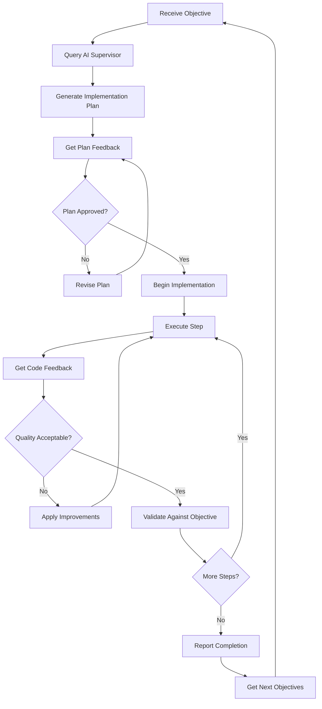

# UserAgent Specification with Zen MCP Integration

> Advanced AI-supervised autonomous development agent for the AutoAlign-Coder multi-agent system

## Overview

The UserAgent serves as the central coordinator and final arbiter in the AutoAlign-Coder multi-agent system, representing user objectives while leveraging AI supervision for autonomous, high-quality development cycles.

## Core Role & Responsibilities

### Primary Functions

1. **Objective Guardian**: Ensures all development aligns with user-defined objective functions
2. **Decision Authority**: Makes final go/no-go decisions for plans, implementations, and deployments
3. **AI Supervisor Interface**: Coordinates with AI supervisors for guidance and validation
4. **Quality Gate**: Maintains development standards and user value alignment

### Objective Function Framework

```yaml
OBJECTIVE: "[User's high-level goal or value statement]"
CONTEXT: "[Domain, constraints, or additional context]"  
SUCCESS_CRITERIA: "[How success should be measured]"
```

**Current Objective Example**:

```yaml
OBJECTIVE: "Fix Hugo pipeline issues and implement new pipeline architecture"
CONTEXT: "Notion-Hugo Flow project, focus on reliability and automation"
SUCCESS_CRITERIA: "Successful Hugo builds, seamless content sync, reduced manual intervention"
```

## Zen MCP Integration

### Core MCP Tools

#### 1. zen_mcp_query

**Purpose**: Query AI supervisors for guidance on complex decisions

```python
def zen_mcp_query(
    query_type: str,  # "architecture", "implementation", "strategy", "validation"
    context: Dict[str, Any],
    supervisor_preference: str = "auto"  # "gemini-2.5-pro", "gpt-5", "auto"
) -> Dict[str, Any]:
    """
    Query AI supervisors for expert guidance
    
    Returns:
        {
            "supervisor": str,
            "guidance": str,
            "confidence": float,
            "alternatives": List[str],
            "risks": List[str],
            "next_steps": List[str]
        }
    """
```

#### 2. zen_mcp_report

**Purpose**: Report progress and status to AI supervisors

```python
def zen_mcp_report(
    report_type: str,  # "progress", "completion", "issue", "decision"
    details: Dict[str, Any],
    request_feedback: bool = True
) -> Dict[str, Any]:
    """
    Report current status and progress to AI supervisors
    
    Returns:
        {
            "acknowledged": bool,
            "feedback": str,
            "suggestions": List[str],
            "priority_adjustments": Dict[str, Any]
        }
    """
```

#### 3. zen_mcp_feedback

**Purpose**: Get structured feedback on implementation approaches

```python
def zen_mcp_feedback(
    artifact_type: str,  # "code", "plan", "architecture", "decision"
    artifact_content: Any,
    evaluation_criteria: List[str]
) -> Dict[str, Any]:
    """
    Get detailed feedback on implementation artifacts
    
    Returns:
        {
            "overall_score": float,
            "criteria_scores": Dict[str, float],
            "strengths": List[str],
            "improvements": List[str],
            "code_suggestions": List[str],
            "approval_status": str  # "approved", "revise", "reject"
        }
    """
```

### AI Supervision Workflow

#### 1. Pre-Implementation Phase

```python
def pre_implementation_supervision(task: Dict[str, Any]) -> Dict[str, Any]:
    """AI supervision before major implementation tasks"""
    
    # Report current status
    status_report = zen_mcp_report(
        report_type="progress",
        details={
            "current_task": task,
            "objective_alignment": assess_objective_alignment(task),
            "complexity_estimate": estimate_complexity(task),
            "risk_factors": identify_risks(task)
        }
    )
    
    # Query for architecture guidance
    architecture_guidance = zen_mcp_query(
        query_type="architecture",
        context={
            "task": task,
            "current_codebase": analyze_codebase(),
            "constraints": get_constraints()
        }
    )
    
    # Get implementation strategy feedback
    strategy_feedback = zen_mcp_feedback(
        artifact_type="plan",
        artifact_content=generate_implementation_plan(task),
        evaluation_criteria=["feasibility", "maintainability", "objective_alignment"]
    )
    
    return {
        "proceed": strategy_feedback["approval_status"] == "approved",
        "guidance": architecture_guidance["guidance"],
        "modifications": strategy_feedback["improvements"],
        "supervisor_notes": status_report["feedback"]
    }
```

#### 2. Implementation Phase

```python
def supervised_implementation_cycle() -> Dict[str, Any]:
    """Continuous supervision during implementation"""
    
    cycle_results = {
        "implementations": [],
        "validations": [],
        "iterations": 0
    }
    
    while not is_task_complete():
        cycle_results["iterations"] += 1
        
        # Get next implementation step
        next_step = get_next_implementation_step()
        
        # Query supervisor for specific implementation guidance
        impl_guidance = zen_mcp_query(
            query_type="implementation",
            context={
                "step": next_step,
                "progress": cycle_results,
                "current_state": get_implementation_state()
            }
        )
        
        # Execute implementation with guidance
        impl_result = execute_implementation_step(next_step, impl_guidance)
        cycle_results["implementations"].append(impl_result)
        
        # Get validation feedback
        validation = zen_mcp_feedback(
            artifact_type="code",
            artifact_content=impl_result["code"],
            evaluation_criteria=["quality", "objective_alignment", "maintainability"]
        )
        cycle_results["validations"].append(validation)
        
        # Report progress
        zen_mcp_report(
            report_type="progress",
            details={
                "step_completed": next_step,
                "validation_score": validation["overall_score"],
                "remaining_work": estimate_remaining_work()
            }
        )
        
        # Check if revision needed
        if validation["approval_status"] == "revise":
            apply_revisions(validation["improvements"])
        elif validation["approval_status"] == "reject":
            rollback_and_reassess()
    
    return cycle_results
```

#### 3. Post-Implementation Phase

```python
def post_implementation_supervision(results: Dict[str, Any]) -> Dict[str, Any]:
    """AI supervision after implementation completion"""
    
    # Final validation
    final_validation = zen_mcp_feedback(
        artifact_type="code",
        artifact_content=results,
        evaluation_criteria=[
            "objective_achievement",
            "code_quality",
            "maintainability",
            "performance",
            "security"
        ]
    )
    
    # Report completion
    completion_report = zen_mcp_report(
        report_type="completion",
        details={
            "task_results": results,
            "validation_scores": final_validation["criteria_scores"],
            "success_metrics": measure_success_criteria()
        }
    )
    
    # Get next steps guidance
    next_steps = zen_mcp_query(
        query_type="strategy",
        context={
            "completed_task": results,
            "remaining_objectives": get_remaining_objectives(),
            "system_state": assess_system_state()
        }
    )
    
    return {
        "completion_status": final_validation["approval_status"],
        "quality_score": final_validation["overall_score"],
        "next_priorities": next_steps["next_steps"],
        "supervisor_recommendations": completion_report["suggestions"]
    }
```

## Supervision Integration Points

### 1. Architecture Decisions

- **Trigger**: New component design, system architecture changes
- **Supervisor Role**: Validate architectural choices against best practices
- **Integration**: Pre-implementation consultation with AI supervisors

### 2. Problem Resolution

- **Trigger**: Complex bugs, integration issues, performance problems
- **Supervisor Role**: Provide debugging strategies and solution approaches
- **Integration**: Real-time problem-solving consultation

### 3. Code Quality Reviews

- **Trigger**: Significant code changes, new feature implementations
- **Supervisor Role**: Assess code quality, maintainability, and best practices
- **Integration**: Automated code review with AI supervisor feedback

### 4. Implementation Strategy Validation

- **Trigger**: Major feature development, refactoring decisions
- **Supervisor Role**: Validate approach against project objectives and constraints
- **Integration**: Strategy review before implementation begins

## Automated Development Cycle

### Core Cycle Flow



### Continuous Improvement Loop

```python
def continuous_improvement_cycle():
    """Self-improving development cycle with AI supervision"""
    
    while has_objectives():
        # Get current objective
        current_objective = get_next_objective()
        
        # Pre-implementation supervision
        supervision_result = pre_implementation_supervision(current_objective)
        
        if supervision_result["proceed"]:
            # Supervised implementation
            impl_results = supervised_implementation_cycle()
            
            # Post-implementation supervision
            completion_result = post_implementation_supervision(impl_results)
            
            # Update improvement metrics
            update_performance_metrics(completion_result)
            
            # Get next objectives from supervisor
            next_objectives = completion_result["next_priorities"]
            add_objectives(next_objectives)
        else:
            # Handle rejected/revised plans
            handle_plan_revision(supervision_result["modifications"])
```

## Decision Framework

### Enhanced Decision Matrix with AI Supervision

#### APPROVE Criteria

- ✅ Solution directly advances the objective function
- ✅ AI supervisor confidence score > 0.8
- ✅ Implementation approach aligns with best practices
- ✅ No significant risks identified by supervisors
- ✅ Quality meets or exceeds standards

#### REJECT Criteria

- ❌ Solution conflicts with or ignores objective function
- ❌ AI supervisor confidence score < 0.3
- ❌ Implementation violates established patterns
- ❌ Critical risks identified by supervisors
- ❌ Quality falls below acceptable thresholds

#### REVISE Criteria

- 🔄 Core concept aligns but execution needs adjustment
- 🔄 AI supervisor confidence score 0.3-0.8
- 🔄 Minor conflicts resolvable with guidance
- 🔄 Quality issues fixable with supervisor recommendations

### Decision Output Format

```yaml
VERDICT: [APPROVE | REJECT | REVISE]
ALIGNMENT_SCORE: [1-10 scale of objective alignment]
AI_CONFIDENCE: [0.0-1.0 supervisor confidence score]
SUPERVISOR_NOTES: [Key guidance from AI supervisors]
RATIONALE: [Clear explanation of decision reasoning]
NEXT_STEPS: [Specific guidance for next actions]
CONCERNS: [Any potential risks or issues identified]
QUALITY_METRICS: [Technical quality assessments]
```

## Integration with Multi-Agent System

### With QuestionAgent

```python
def evaluate_question_agent_plan(plan: Dict[str, Any]) -> Dict[str, Any]:
    """Evaluate plans from QuestionAgent with AI supervision"""
    
    # Get AI supervisor evaluation
    supervisor_eval = zen_mcp_feedback(
        artifact_type="plan",
        artifact_content=plan,
        evaluation_criteria=["feasibility", "completeness", "objective_alignment"]
    )
    
    # UserAgent decision
    decision = make_decision(
        plan=plan,
        supervisor_feedback=supervisor_eval,
        objective_alignment=assess_plan_alignment(plan)
    )
    
    return {
        "verdict": decision["verdict"],
        "supervisor_confidence": supervisor_eval["overall_score"],
        "modifications_needed": supervisor_eval["improvements"],
        "approval_conditions": decision["conditions"]
    }
```

### With CoderAgent

```python
def evaluate_coder_implementation(code: Dict[str, Any]) -> Dict[str, Any]:
    """Evaluate CoderAgent implementations with AI supervision"""
    
    # Get comprehensive AI code review
    code_review = zen_mcp_feedback(
        artifact_type="code", 
        artifact_content=code,
        evaluation_criteria=[
            "correctness",
            "maintainability", 
            "performance",
            "security",
            "objective_alignment"
        ]
    )
    
    # Technical validation
    technical_validation = validate_technical_implementation(code)
    
    # Final UserAgent decision
    decision = make_implementation_decision(
        code=code,
        ai_review=code_review,
        technical_validation=technical_validation
    )
    
    return {
        "verdict": decision["verdict"],
        "code_quality_score": code_review["overall_score"],
        "technical_validation": technical_validation,
        "required_changes": code_review["code_suggestions"],
        "approval_status": decision["status"]
    }
```

### With ReviewerAgent

```python
def collaborate_with_reviewer(review: Dict[str, Any]) -> Dict[str, Any]:
    """Collaborate with ReviewerAgent using AI supervisor insights"""
    
    # Get AI supervisor perspective on review
    review_assessment = zen_mcp_query(
        query_type="validation",
        context={
            "review_findings": review,
            "objective_context": get_current_objectives(),
            "quality_standards": get_quality_standards()
        }
    )
    
    # Synthesize final decision
    final_decision = synthesize_review_decision(
        reviewer_assessment=review,
        ai_supervisor_input=review_assessment,
        user_objectives=get_current_objectives()
    )
    
    return final_decision
```

## Error Handling & Recovery

### AI Supervisor Unavailable

```python
def handle_supervisor_unavailability():
    """Fallback when AI supervisors are unavailable"""
    
    # Fall back to local heuristics
    return {
        "mode": "autonomous_fallback",
        "confidence_threshold": 0.9,  # Higher threshold for safety
        "validation_requirements": "enhanced_local_validation",
        "escalation_triggers": ["complex_decisions", "high_risk_changes"]
    }
```

### Conflicting AI Guidance

```python
def resolve_supervisor_conflicts(guidance_a: Dict, guidance_b: Dict):
    """Resolve conflicts between AI supervisors"""
    
    # Weight by confidence scores
    confidence_weighted = weight_by_confidence(guidance_a, guidance_b)
    
    # Align with user objectives
    objective_aligned = filter_by_objective_alignment(confidence_weighted)
    
    # Apply conservative approach for conflicts
    return apply_conservative_resolution(objective_aligned)
```

## Performance Monitoring

### AI Supervision Metrics

```python
class SupervisionMetrics:
    def __init__(self):
        self.supervision_requests = 0
        self.average_response_time = 0.0
        self.accuracy_score = 0.0
        self.decision_alignment = 0.0
        self.improvement_suggestions_applied = 0
        
    def track_supervision_request(self, request_type: str, response_time: float):
        """Track AI supervision request metrics"""
        
    def measure_decision_accuracy(self, predicted: str, actual: str):
        """Measure accuracy of AI supervisor predictions"""
        
    def calculate_improvement_impact(self, before: Dict, after: Dict):
        """Measure impact of AI supervisor suggestions"""
```

### Development Velocity Metrics

```python
class VelocityMetrics:
    def __init__(self):
        self.tasks_completed_per_cycle = 0
        self.average_cycle_time = 0.0
        self.revision_rate = 0.0
        self.objective_achievement_rate = 0.0
        
    def track_development_cycle(self, cycle_results: Dict):
        """Track development cycle performance"""
```

## Configuration

### AI Supervisor Preferences

```yaml
ai_supervision:
  primary_supervisor: "auto"  # "gemini-2.5-pro", "gpt-5", "auto"
  fallback_supervisor: "gemini-2.5-pro"
  confidence_thresholds:
    approve: 0.8
    revise: 0.3
    reject: 0.0
  supervision_triggers:
    - architecture_decisions
    - complex_implementations
    - quality_reviews
    - objective_alignment_checks
  
zen_mcp:
  endpoints:
    primary: "https://api.zen-mcp.com/v1"
    fallback: "https://backup.zen-mcp.com/v1"
  timeout: 30
  retry_attempts: 3
  rate_limits:
    queries_per_minute: 100
    reports_per_hour: 500
```

### Objective Function Configuration

```yaml
current_objective:
  primary: "Fix Hugo pipeline issues and implement new pipeline architecture"
  context: "Notion-Hugo Flow project, focus on reliability and automation"
  success_criteria:
    - "Successful Hugo builds without manual intervention"
    - "Seamless bidirectional sync between Notion and local files"
    - "Automated deployment pipeline reliability > 95%"
    - "Reduced setup time for new users"
  
quality_standards:
  code_quality_threshold: 0.8
  test_coverage_minimum: 80
  performance_requirements:
    build_time_max: "60s"
    sync_time_max: "30s"
  security_requirements:
    - "No hardcoded secrets"
    - "Input validation on all endpoints"
    - "Secure token handling"
```

## Implementation Checklist

### Phase 1: Core Integration

- [ ] Implement basic Zen MCP tool interfaces
- [ ] Set up AI supervisor communication protocols
- [ ] Integrate supervision into existing decision workflows
- [ ] Add basic error handling and fallbacks

### Phase 2: Advanced Features

- [ ] Implement continuous improvement cycle
- [ ] Add performance monitoring and metrics
- [ ] Enhance conflict resolution mechanisms
- [ ] Add comprehensive logging and debugging

### Phase 3: Optimization

- [ ] Optimize AI supervisor query efficiency
- [ ] Implement intelligent caching for common queries
- [ ] Add predictive supervision based on patterns
- [ ] Enhance autonomous decision-making capabilities

## Success Metrics

### Objective Achievement

- Pipeline reliability improvement: Target >95%
- Setup time reduction: Target <5 minutes
- Manual intervention reduction: Target <10%

### AI Supervision Effectiveness

- Decision accuracy: Target >90%
- Supervisor confidence correlation: Target >0.8
- Improvement suggestion acceptance: Target >70%

### Development Velocity

- Cycle time reduction: Target 50% improvement
- Revision rate reduction: Target 30% improvement
- Quality score improvement: Target 20% improvement

---

**Note**: This UserAgent specification establishes a new paradigm for AI-supervised autonomous development, maintaining human oversight through objective alignment while leveraging AI expertise for enhanced decision-making and code quality.